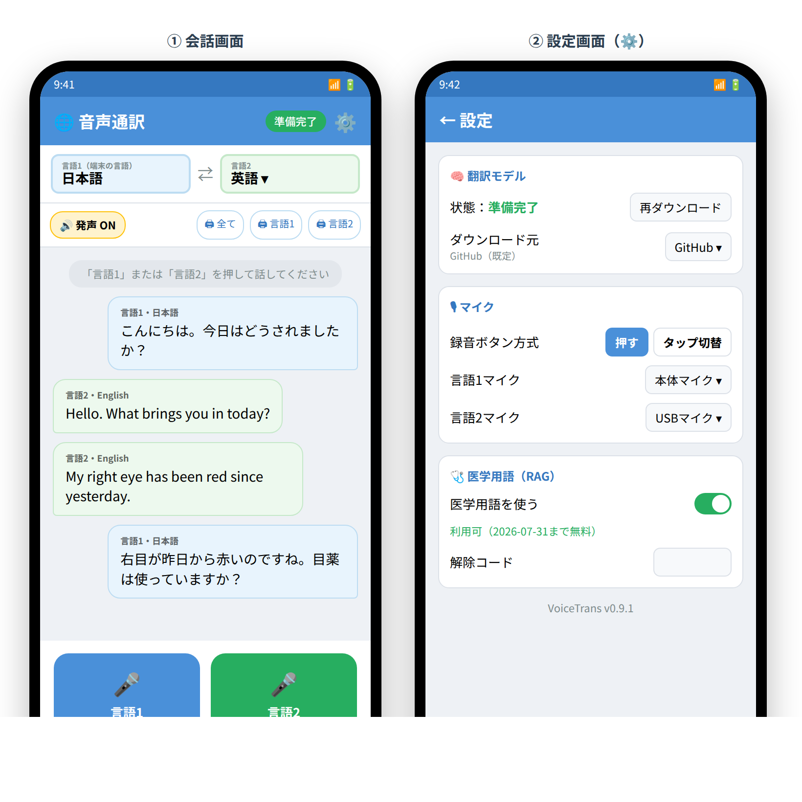

# 音声通訳（VoiceTrans / Android 単独動作）

> **📱 iOS（iPhone）版 協力者募集中**
> ソースは用意できていますが、**コンパイル環境（Mac）が無く**、配布に **Apple Developer 登録（99ドル/年）** も
> 必要なため**保留中**です。ビルド・配布にご協力いただける方を募集しています。

スマートフォン単独（ネットにつながないで動作）で使える音声通訳アプリ。
端末内の生成AI **Gemma（E4B）** が音声認識と翻訳を行い、内蔵音声合成で読み上げます。
Google Pixel 9a 以上を想定。

> **⏳ 本バージョンは試用版です**：**2026-07-31 まで無料・全機能（医学用語RAG含む）が利用可能**。
> 期限後はアプリの利用に**解除コード**が必要になります（本バージョンは広告なし）。

```
マイク(本体/USB) → 録音 → Gemma E4B(音声→原文＋翻訳) → 端末内TTSで発声
```

## ⬇ ダウンロード（Android）— 2つの版があります

| 版 | 状態 | モデル | 速度 | ダウンロード |
|----|------|--------|------|------|
| **✅ Gemma 3 版** | **安定（推奨）** | Gemma 3n E4B（約4.9GB） | GPUで高速 | [voicetrans-0.9.1-gemma3.apk](https://github.com/batake321/voicetrans-android/releases/download/gemma3/voicetrans-0.9.1-gemma3.apk) |
| 🧪 Gemma 4 版 | **デバッグ中** | Gemma 4 E4B（約3.7GB） | CPU動作のため遅め | [voicetrans-0.9.6.apk](https://github.com/batake321/voicetrans-android/releases/download/v0.9.0/voicetrans-0.9.6.apk) |

- **まずは ✅ Gemma 3 版** をお使いください（安定して動作します）。
- 🧪 **Gemma 4 版は現在デバッグ中**です。最新モデルですが、GPU推論で音声認識が固まる問題があり、暫定的に**CPU動作（遅い）**にしています。動作が不安定なことがあります。
- 2版は別アプリ扱いではなく、**どちらか一方をインストール**してお使いください（後から入れ替え可）。
- 各リリース: [Gemma 3](https://github.com/batake321/voicetrans-android/releases/tag/gemma3) ／ [Gemma 4](https://github.com/batake321/voicetrans-android/releases/tag/v0.9.0)

## 📖 使い方（画面つき）



### 1. インストール
APK をダウンロードして開き、「提供元不明アプリのインストール」を許可してインストールします。

### 2. 翻訳モデルを取得（初回のみ）
- 起動するとヘッダのバッジが **「⬇ モデルDL」** になります。タップ（または ⚙️設定 → 翻訳モデル → ダウンロード）。
- モデル（Gemma 3 版＝約**4.9GB** / Gemma 4 版＝約**3.7GB**）をダウンロード（進捗％・残り時間を表示、**Wi-Fi推奨**、途中で切れても**自動で再開**）。
- 完了するとバッジが **「準備完了」** になります（モデルはアプリ専用領域に保存。アンインストールで自動削除）。

### 3. 言語を選ぶ
- **言語1**＝端末の設定言語（既定：日本語）。
- **言語2**＝右上のプルダウンで翻訳したい外国語を選択（**全17言語**：英語/中国語/韓国語/スペイン語/ベトナム語/タイ語 ほか）。

### 4. 話して翻訳する
- 画面下の **「言語1」/「言語2」ボタンを押しながら話し、離す**と認識→翻訳します。
- まず**話した原文**が表示され（認識結果の確認）、続いて**訳文**が表示されます（🔊発声ONなら読み上げ）。
- 表示位置：**言語1＝右（青）／言語2＝左（緑）**。先に話した側が先に出ます。
- 認識がおかしいときは処理中の **「■ 中止」** で取り消せます。

### 5. マイクの使い分け（1本でも2本でも）
- ⚙️設定 → マイク：**言語1・言語2に同じ本体マイクを割り当てて1台で**使うことも、
  **USBマイクを足して言語ごとに分けて**認識させることも可能。
- **録音ボタン方式**：「押す」（押している間だけ録音）／「タップ切替」（1タップ開始 → **無音で自動確定**）。

### 6. 医学用語（RAG）
- ⚙️設定 → 医学用語：ONにすると**医療・眼科の専門用語の精度**が上がります（**2026-07-31まで無料**）。
- 期限後は ⚙️に表示される **アクティベーションID** を提供元（Batake）へ送り、返ってきた**解除コード**を入力すると継続できます。

### 7. その他
- 🔊 **発声 ON/OFF**、🖨 **印刷**（全て／言語1のみ／言語2のみ）、**文字サイズ**変更（設定）。
- UIの表示言語は端末の言語設定に追従します。

## 翻訳モデルとライセンス（重要）
本アプリは Google の **Gemma**（Gemma 3 版＝Gemma 3n E4B／Gemma 4 版＝Gemma 4 E4B）を利用します。利用は
[Gemma 利用規約](https://ai.google.dev/gemma/terms) と
[使用禁止ポリシー](https://ai.google.dev/gemma/prohibited_use_policy) に従います。
配布物に `NOTICE` を同梱。オンデバイス推論は Google AI Edge LiteRT / LiteRT-LM を使用。
モデルは各 Releases に分割（GitHubの2GB/ファイル制限のため約1.8GBごと）して置かれ、アプリが自動で結合します。

## iOS（iPhone）版について（協力者募集）
ソースは用意済みですが、ビルドには Mac+Xcode（または GitHub Actions の macOS ビルド）が必要で、
配布は Apple の仕様上 **TestFlight / App Store** 経由（**Apple Developer 年99ドル**）になります。
コンパイル環境・配布にご協力いただける方を募集中です。

---
© Batake / VoiceTrans
